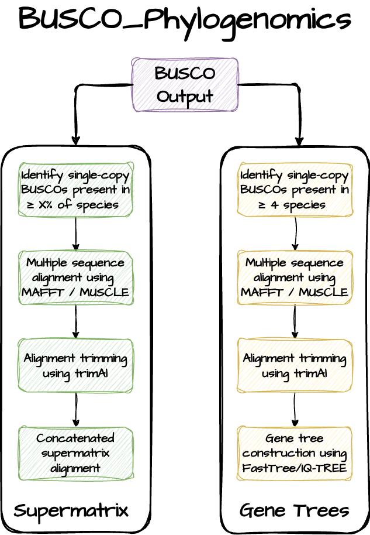

# BUSCO Phylogenomics

[](http://bioconda.github.io/recipes/busco_phylogenomics/README.html)


[Jamie McGowan, 2024](https://jamiemcgowan.ie)


This is a Python pipeline to construct species phylogenies using BUSCO proteins. It works directly from BUSCO output and can generate concatenated supermatrix alignments and also gene trees of BUSCO families.


The pipeline identifies BUSCO proteins that are complete and single-copy in all input samples. Alternatively, you can account for missing data and choose to include BUSCO proteins that are complete and single-copy in a certain percentage of input samples. Each BUSCO family is individually aligned, trimmed, and then concatenated together to generate a supermatrix alignment. The pipeline also identifies BUSCO proteins that are complete and single-copy in at least 4 input samples, and generates gene trees for each of these families.



### Dependencies

The pipeline requires the following dependencies:

- [python](https://www.python.org/)
- [biopython](https://biopython.org/)
- [muscle](https://www.drive5.com/muscle/)
- [trimal](https://github.com/inab/trimal)
- [fasttree](http://www.microbesonline.org/fasttree/)
- [iqtree](http://www.iqtree.org/)

These should be available from your `$PATH`.

You can install the BUSCO_Phylogenomics package with Conda from the Bioconda channel:

```
conda create -n BUSCO_phylogenomics -c bioconda busco_phylogenomics
conda activate BUSCO_phylogenomics

BUSCO_phylogenomics.py --help
count_buscos.py --help
```


Alternatively, you can manually install the package and dependencies using conda with the provided yaml file `conda_env.yaml`, which will create a conda environment called BUSCO_phylogenomics

```
git clone https://github.com/jamiemcg/BUSCO_phylogenomics
cd BUSCO_phylogenomics

conda env create -f conda_env.yaml
conda activate BUSCO_phylogenomics

BUSCO_phylogenomics.py --help
count_buscos.py --help
```

### Usage

```
python BUSCO_phylogenomics.py --help

usage: BUSCO_phylogenomics.py [-h] -i INPUT -o OUTPUT -t THREADS [--supermatrix_only] [--gene_trees_only] [-psc PSC] [--trimal_strategy TRIMAL_STRATEGY] [--missing_character MISSING_CHARACTER] [--gene_tree_program GENE_TREE_PROGRAM] [--busco_version_3]

Perform phylogenomic reconstruction using BUSCO proteins

options:
  -h, --help            show this help message and exit
  -i INPUT, --input INPUT
                        Input directory containing completed BUSCO runs
  -o OUTPUT, --output OUTPUT
                        Output directory to store results
  -t THREADS, --threads THREADS
                        Number of threads to use
  --supermatrix_only    Don't generate gene trees
  --gene_trees_only     Don't perform supermatrix analysis
  --nt                  Align nucleotide sequences instead of amino acid
                        sequences
  -psc PSC, --percent_single_copy PSC
                        BUSCO presence cut-off. BUSCOs that are complete and
                        single-copy in at least [-psc] percent of species will
                        be included in the contatenated alignment
                        [default=100.0]
  --trimal_strategy TRIMAL_STRATEGY
                        trimal trimming strategy (automated1, gappyout,
                        strict, strictplus) [default=automated1]
  --missing_character MISSING_CHARACTER
                        Character to represent missing data [default='?']
  --gene_tree_program GENE_TREE_PROGRAM
                        Program to use to generate gene trees (fasttree or
                        iqtree) [default=fasttree]
  --busco_version_3     Flag to indicate that BUSCO version 3 was used (which
                        has slighly different output structure)
```

You should move all of your completed BUSCO output directories into the same directory.


**Example usage:**

```
python BUSCO_phylogenomics.py -i BUSCO_results -o output_busco_phylogenomics -t 8
```

This will look in the "BUSCO\_results" directory for completed BUSCO runs, generate multiple sequence alignments for all complete single-copy proteins that were found in all samples, trim alignments with trimal and then concatenate them together, generating a concatenated alignment in Fasta and Phylip format along with a partitions file in NEXUS format. It will also generate gene trees for all BUSCO proteins that are complete and single-copy in at least 4 samples. The output will be stored in a directory named "output\_busco\_phylogenomics". The pipeline is written to be executed on a single node/machine, here 8 parallel alignment/trimming/phylogeny jobs would run.


If you don't want to generate gene trees, you can use the parameter `--supermatrix-only` to only generate the concatenated alignment.

If you don't want to generate a concatenated alignment, you can use the parameter `--gene_trees_only` to only generate gene trees.

By default, the pipeline works in protein space (i.e., aligns amino acid sequences). The `--nt` flag switches to using BUSCO nucleotide sequences instead of proteins.

If you have a patchy dataset and want to include BUSCO proteins in your concatenated alignment that aren't universally present, you can use the `--percent_single_copy` parameter.

For example:

```
python BUSCO_phylogenomics.py -i BUSCO_results -o output_busco_phylogenomics -t 8 --percent_single_copy 70
```

will include all BUSCO families that are complete and single-copy in at least 70% of samples in your concatenated alignment. Missing data will be represented by "?" characters in the concatenated alignment by default. You can specify a different character to represent missing data with the `--missing_character` parameter.

The provided `count_buscos.py` script can be used to count single-copy BUSCOs and summarise BUSCO presence/absences across
samples to determine an appropriate cut-off for how much missing data to allow (--percent\_single\_copy).


```
python count_buscos.py -i BUSCO_runs
```

This will report how many BUSCOs are complete and single-copy in what percentage of samples and print a presence/absence table for each BUSCO family.

If you used BUSCO version 3 you should use the flag `--busco_version_3` as the output structure of this version of BUSCO is slightly different to that of versions 4 and 5.

<details>
<summary><strong>Publications that use the BUSCO_phylogenomics pipeline (to Sept 2024):</strong></summary>

<ol>
<li>2024. Whole genome phylogenomics helps to resolve the phylogenetic position of the Zygothrica genus group (Diptera, Drosophilidae) and the causes of previous incongruences. Molecular Phylogenetics and Evolution. Bessa, Maiara Hartwig; Gottschalk, Marco Silva; Robe, Lizandra Jaqueline;</li>
<li>2024. The nuclear and mitochondrial genome assemblies of Tetragonisca angustula (Apidae: Meliponini), a tiny yet remarkable pollinator in the Neotropics. BMC genomics. Ferrari, Rafael Rodrigues; Ricardo, Paulo Cseri; Dias, Felipe Cordeiro; de Souza Araujo, Natalia; Soares, Dalliane Oliveira; Zhou, Qing-Song; Zhu, Chao-Dong; Coutinho, Luiz Lehmann; Arias, Maria Cristina; Batista, Thiago Mafra;</li>
<li>2024. Hybrid assembly and comparative genomics unveil insights into the evolution and biology of the red-legged partridge. Scientific Reports. Eleiwa, Abderrahmane; Nadal, Jesus; Vilaprinyo, Ester; Marin-Sanguino, Alberto; Sorribas, Albert; Basallo, Oriol; Lucido, Abel; Richart, Cristobal; Pena, Ramona N; Ros-Freixedes, Roger;</li>
<li>2024. Phylogenomics corroborates morphology: New discussions on the systematics of Trichostomatia (Ciliophora, Litostomatea). European Journal of Protistology. Cedrola, Franciane; Gürelli, Gözde; Senra, Marcus Vinicius Xavier; Morales, Millke Jasmine Arminini; Dias, Roberto Júnio Pedroso; Solferini, Vera Nisaka;</li>
<li>2024. Multiple Independent Genetic Code Reassignments of the UAG Stop Codon in Phyllopharyngean Ciliates. bioRxiv. McGowan, Jamie; Richards, Thomas A; Hall, Neil; Swarbreck, David;</li>
<li>2024. Dissecting the Pandora’s box: preliminary phylogenomic insights into the internal and external relationships of stink bugs (Hemiptera: Pentatomidae). Insect Systematics and Diversity. Genevcius, Bruno C;</li>
<li>2024. Genome report: Genome sequence of tuliptree scale, Toumeyella liriodendri (Gmelin), an ornamental pest insect. G3: Genes, Genomes, Genetics. Mongue, Andrew J; Markee, Amanda; Grebler, Ethan; Liesenfelt, Tracy; Powell, Erin C;</li>
<li>2024. An almost chromosome-level assembly and annotation of the Alectoris rufa genome. bioRxiv. Eleiwa, Abderrahmane; Nadal, Jesus; Vilaprinyo, Ester; Marin-Sanguino, Alberto; Sorribas, Albert; Basallo, Oriol; Lucido, Abel; Richart, Cristobal; Pena, Romi N; Ros-Freixedes, Roger;</li>
<li>2024. Unveiling the Arsenal of Apple Bitter Rot Fungi: Comparative Genomics Identifies Candidate Effectors, CAZymes, and Biosynthetic Gene Clusters in Colletotrichum Species. Journal of Fungi. Khodadadi, Fatemeh; Luciano-Rosario, Dianiris; Gottschalk, Christopher; Jurick, Wayne M; Aćimović, Srđan G;</li>
<li>2024. The Near-Gapless Penicillium fuscoglaucum Genome Enables the Discovery of Lifestyle Features as an Emerging Post-Harvest Phytopathogen. Journal of Fungi. Luciano-Rosario, Dianiris; Jurick, Wayne M; Gottschalk, Christopher;</li>
<li>2024. Advancing apple genetics research: Malus coronaria and Malus ioensis genomes and a gene family-based pangenome of native North American apples. DNA Research. Švara, Anže; Sun, Honghe; Fei, Zhangjun; Khan, Awais;</li>
<li>2024. Genome report: Genome sequence of the tuliptree scale insect, Toumeyella liriodendri (Gmelin). bioRxiv. Mongue, Andrew J; Markee, Amanda; Grebler, Ethan; Liesenfelt, Tracy; Powell, Erin C;</li>
<li>2024. Spathaspora marinasilvae sp. nov., a xylose‐fermenting yeast isolated from galleries of passalid beetles and rotting wood in the Amazonian rainforest biome. Yeast. Barros, Katharina O; Batista, Thiago M; Soares, Rafaela CC; Lopes, Mariana R; Alvarenga, Flávia BM; Souza, Gisele FL; Abegg, Maxwel A; Santos, Ana Raquel O; Góes‐Neto, Aristóteles; Hilário, Heron O;</li>
<li>2024. Unveiling genomic features linked to traits of plant growth-promoting bacterial communities from sugarcane. Science of The Total Environment. Funnicelli, Michelli Inácio Gonçalves; de Carvalho, Lucas Amoroso Lopes; Teheran-Sierra, Luis Guillermo; Dibelli, Sabrina Custodio; de Macedo Lemos, Eliana Gertrudes; Pinheiro, Daniel Guariz;</li>
<li>2024. Spencermartinsiella nicolii sp. nov., a potential opportunistic pathogenic yeast species isolated from rotting wood in Brazil. International Journal of Systematic and Evolutionary Microbiology. Barros, Katharina O; Valério, Aline D; Batista, Thiago M; Santos, Ana Raquel O; Souza, Gisele FL; Alvarenga, Flávia BM; Lopes, Mariana R; Morais, Camila G; Alves, Cristina; Goes-Neto, Aristóteles;</li>
<li>2024. Chromosome-level genome assembly of the yeast Lodderomyces beijingensis reveals the genetic nature of metabolic adaptations and identifies subtelomeres as hotspots for amplification of mating type loci. DNA Research. Brejová, Broňa; Hodorová, Viktória; Mutalová, Sofia; Cillingová, Andrea; Tomáška, Ľubomír; Vinař, Tomáš; Nosek, Jozef;</li>
<li>2024. Phylogeny, morphology, virulence, ecology, and host range of Ordospora pajunii (Ordosporidae), a microsporidian symbiont of Daphnia spp.. Mbio. Dziuba, Marcin K; McIntire, Kristina M; Seto, Kensuke; Davenport, Elizabeth S; Rogalski, Mary A; Gowler, Camden D; Baird, Emma; Vaandrager, Megan; Huerta, Cristian; Jaye, Riley;</li>
<li>2024. Análise filogenômica. Batista, Thiago Mafra;</li>
<li>2024. Phylogenomic Insights into the Taxonomy, Ecology, and Mating Systems of the Lorchel Family Discinaceae (Pezizales, Ascomycota). Dirks, Alden; Methven, Andrew S; Miller, Andrew Nicholas; Orozco-Quime, Michelle; Maurice, Sundy; Bonito, Gregory; Van Wyk, Judson; Ahrendt, Steven; Kuo, Alan; Andreopoulos, William;</li>
<li>2024. Multiple Independent Genetic Code Reassignments of the UAG Stop Codon in Phyllopharyngean Ciliates. bioRxiv. McGowan, Jamie; Richards, Thomas A; Hall, Neil; Swarbreck, David;</li>
<li>2023. Exploring evolutionary relationships within Neodermata using putative orthologous groups of proteins, with emphasis on peptidases. Tropical medicine and infectious disease. Caña-Bozada, Víctor; Robinson, Mark W; Hernández-Mena, David I; Morales-Serna, Francisco N;</li>
<li>2023. High nucleotide similarity of three Copia lineage LTR retrotransposons among plant genomes. Genome. Orozco-Arias, Simon; Dupeyron, Mathilde; Gutiérrez-Duque, David; Tabares-Soto, Reinel; Guyot, Romain;</li>
<li>2023. De Novo Whole Genome Assemblies for Two Southern African Dwarf Chameleons (Bradypodion, Chamaeleonidae). Genome biology and evolution. Taft, Jody M; Tolley, Krystal A; Alexander, Graham J; Geneva, Anthony J;</li>
<li>2023. Decoding the chromosome-scale genome of the nutrient-rich Agaricus subrufescens: A Resource for fungal biology and biotechnology. Authorea Preprints. Godinho, Carlos; Roesch, Luiz; Andreote, Fernndo; Silva, Saura; Junqueira, Tatiana; Zied, Diego; Siqueira, Felix; Dias, Eustáquio; Varani, Alessandro; Pylro, Victor;</li>
<li>2023. Description of Pseudocalidococcus azoricus gen. sp. nov.(Thermosynechococcaceae, Cyanobacteria), a Rare but Widely Distributed Coccoid Cyanobacteria. Diversity. Luz, Rúben; Cordeiro, Rita; Kaštovský, Jan; Fonseca, Amélia; Urbatzka, Ralph; Vasconcelos, Vitor; Gonçalves, Vítor;</li>
<li>2023. Genome of the North American wild apple species Malus angustifolia. bioRxiv. Mansfeld, Ben N; Ou, Shujun; Burchard, Erik; Yocca, Alan; Harkess, Alex; Gutierrez, Benjamin; van Nocker, Steve; Tang, Lisa; Gottschalk, Christopher;</li>
<li>2023. Genomic analysis of Ancylistes closterii, an enigmatic alga parasitic fungus in the arthropod-associated Entomophthoromycotina. bioRxiv. Seto, Kensuke; James, Timothy Y;</li>
<li>2023. Mesnilia travisiae gen. nov., sp. nov.(Microsporidia: Metchnikovellida), a parasite of archigregarines Selenidium sp. from the polychaete Travisia forbesii: morphology, molecular phylogeny and phylogenomics. Protistology. Frolova, Ekaterina V; Raiko, Mikhail P; Bondarenko, Natalya I; Paskerova, Gita G; Simdyanov, Timur G; Smirnov, Alexey V; Nassonova, Elena S;</li>
<li>2023. Decoding the chromosome-scale genome of the nutrient-rich Agaricus subrufescens: a resource for fungal biology and biotechnology. Research in Microbiology. de Abreu, Carlos Godinho; Roesch, Luiz Fernando Wurdig; Andreote, Fernando Dini; Silva, Saura Rodrigues; de Moraes, Tatiana Silveira Junqueira; Zied, Diego Cunha; de Siqueira, Félix Gonçalves; Dias, Eustáquio Souza; Varani, Alessandro M; Pylro, Victor Satler;</li>
<li>2023. A genome catalog of the early-life human skin microbiome. Genome Biology. Shen, Zeyang; Robert, Lukian; Stolpman, Milan; Che, You; Allen, Katrina J; Saffery, Richard; Walsh, Audrey; Young, Angela; Eckert, Jana; Deming, Clay;</li>
<li>2023. Saccharomycopsis praedatoria sp. nov., a predacious yeast isolated from soil and rotten wood in an Amazonian rainforest biome. International Journal of Systematic and Evolutionary Microbiology. Santos, Ana Raquel O; Barros, Katharina O; Batista, Thiago M; Souza, Gisele FL; Alvarenga, Flávia BM; Abegg, Maxwel A; Sato, Trey K; Hittinger, Chris Todd; Lachance, Marc-André; Rosa, Carlos A;</li>
<li>2023. Genetic basis for probiotic yeast phenotypes revealed by nanopore sequencing. G3: Genes, Genomes, Genetics. Collins, Joseph H; Kunyeit, Lohith; Weintraub, Sarah; Sharma, Nilesh; White, Charlotte; Haq, Nabeeha; Anu-Appaiah, KA; Rao, Reeta P; Young, Eric M;</li>
<li>2023. Characteristic genomic traits of bacterial genera associated with sugarcane. Funnicelli, Michelli Inácio Gonçalves;</li>
<li>2023. The skin microbiome in health and atopic dermatitis. Saheb Kashaf, Sara;</li>
<li>2023. Identification of a non-canonical ciliate nuclear genetic code where UAA and UAG code for different amino acids. PLoS Genetics. McGowan, Jamie; Kilias, Estelle S; Alacid, Elisabet; Lipscombe, James; Jenkins, Benjamin H; Gharbi, Karim; Kaithakottil, Gemy G; Macaulay, Iain C; McTaggart, Seanna; Warring, Sally D;</li>
<li>2022. De novo genome assembly of Auanema melissensis, a trioecious free-living nematode. Journal of Nematology. Tandonnet, Sophie; Haq, Maairah; Turner, Anisa; Grana, Theresa; Paganopoulou, Panagiota; Adams, Sally; Dhawan, Sandhya; Kanzaki, Natsumi; Nuez, Isabelle; Félix, Marie-Anne;</li>
<li>2022. Pan-genomic and comparative analysis of Pediococcus pentosaceus focused on the in silico assessment of pediocin-like bacteriocins. Computational and Structural Biotechnology Journal. Blanco, Iago Rodrigues; Pizauro, Lucas José Luduverio; dos Anjos Almeida, João Victor; Mendonça, Carlos Miguel Nóbrega; de Mello Varani, Alessandro; de Souza Oliveira, Ricardo Pinheiro;</li>
<li>2022. Hybrid assembly improves genome quality and completeness of Trametes villosa CCMB561 and reveals a huge potential for lignocellulose breakdown. Journal of Fungi. Tomé, Luiz Marcelo Ribeiro; da Silva, Felipe Ferreira; Fonseca, Paula Luize Camargos; Mendes-Pereira, Thairine; Azevedo, Vasco Ariston de Carvalho; Brenig, Bertram; Badotti, Fernanda; Góes-Neto, Aristóteles;</li>
<li>2022. The first de novo genome assembly and sex marker identification of Pluang Chomphu fish (Tor tambra) from Southern Thailand. Computational and Structural Biotechnology Journal. Surachat, Komwit; Deachamag, Panchalika; Wonglapsuwan, Monwadee;</li>
<li>2022. Integrating cultivation and metagenomics for a multi-kingdom view of skin microbiome diversity and functions. Nature microbiology. Saheb Kashaf, Sara; Proctor, Diana M; Deming, Clay; Saary, Paul; Hölzer, Martin; Taylor, Monica E; Kong, Heidi H; Segre, Julia A; Almeida, Alexandre;</li>
<li>2020. Draft genome of Bugula neritina, a colonial animal packing powerful symbionts and potential medicines. Scientific data. Rayko, Mikhail; Komissarov, Aleksey; Kwan, Jason C; Lim-Fong, Grace; Rhodes, Adelaide C; Kliver, Sergey; Kuchur, Polina; O’Brien, Stephen J; Lopez, Jose V;</li>
<li>2020. Comparative genomic and proteomic analyses of three widespread Phytophthora species: Phytophthora chlamydospora, Phytophthora gonapodyides and Phytophthora pseudosyringae. Microorganisms. McGowan, Jamie; O’Hanlon, Richard; Owens, Rebecca A; Fitzpatrick, David A;</li>
<li>2020. Recent advances in oomycete genomics. Advances in genetics. McGowan, Jamie; Fitzpatrick, David A;</li>
</ol>
</details>