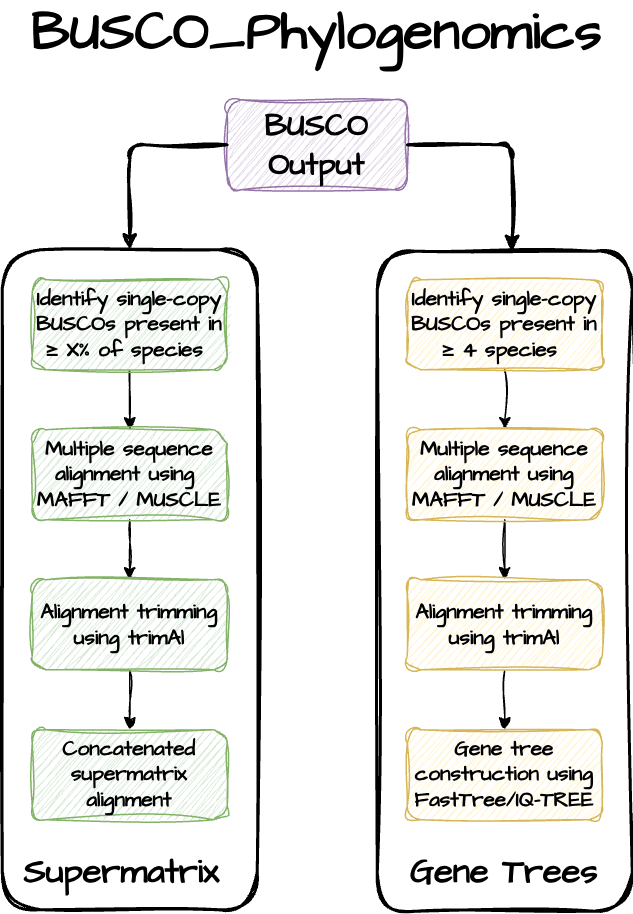

# BUSCO_Phylogenomics

[](http://bioconda.github.io/recipes/busco_phylogenomics/README.html)


[Jamie McGowan, 2026](https://jamiemcgowan.ie)


This is a simple, easy-to-use pipeline to construct species phylogenies using BUSCO proteins. It works directly from BUSCO output and can generate concatenated supermatrix alignments and also gene trees of BUSCO families.


The pipeline identifies BUSCO proteins that are complete and single-copy in all input samples. Alternatively, you can account for missing data and choose to include BUSCO proteins that are complete and single-copy in a certain percentage of input samples. Each BUSCO family is individually aligned, trimmed, and then concatenated together to generate a supermatrix alignment. The pipeline also identifies BUSCO proteins that are complete and single-copy in at least 4 input samples, and generates gene trees for each of these families.





🆘❓📧 **Got a question or need some help? Open an issue or feel free to email me - <jamie.mcgowan@ucd.ie>**

---

### Dependencies

The pipeline requires the following dependencies:

- [python](https://www.python.org/)
- [biopython](https://biopython.org/)
- [muscle](https://www.drive5.com/muscle/)
- [mafft](https://mafft.cbrc.jp/)
- [trimal](https://github.com/inab/trimal)
- [fasttree](http://www.microbesonline.org/fasttree/)
- [iqtree](http://www.iqtree.org/)
- [tqdm](https://github.com/tqdm/tqdm)

These should be available from your `$PATH`.

You can install the BUSCO_Phylogenomics package with Conda from the Bioconda channel:

```
conda create -n BUSCO_phylogenomics -c bioconda busco_phylogenomics
conda activate BUSCO_phylogenomics

BUSCO_phylogenomics.py --help
count_buscos.py --help
```


Alternatively, you can manually install the packages and dependencies using conda with the provided yaml file `conda_env.yaml`, which will create a conda environment called BUSCO_phylogenomics

```
git clone https://github.com/jamiemcg/BUSCO_phylogenomics
cd BUSCO_phylogenomics

conda env create -f conda_env.yaml
conda activate BUSCO_phylogenomics

BUSCO_phylogenomics.py --help
count_buscos.py --help
```

### Usage

```
python BUSCO_phylogenomics.py --help

usage: BUSCO_phylogenomics.py [-h] -i INPUT -o OUTPUT -t THREADS [--supermatrix_only] [--gene_trees_only] [-psc PSC] [--trimal_strategy TRIMAL_STRATEGY] [--missing_character MISSING_CHARACTER] [--gene_tree_program GENE_TREE_PROGRAM] [--busco_version_3]

Perform phylogenomic reconstruction using BUSCO proteins

options:
  -h, --help            show this help message and exit
  -i INPUT, --input INPUT
                        Input directory containing completed BUSCO runs
  -o OUTPUT, --output OUTPUT
                        Output directory to store results
  -t THREADS, --threads THREADS
                        Number of threads to use
  --supermatrix_only    Don't generate gene trees
  --gene_trees_only     Don't perform supermatrix analysis
  --nt                  Align nucleotide sequences instead of amino acid
                        sequences. Does NOT work if miniprot was used to
                        identify BUSCOs.
  -psc PSC, --percent_single_copy PSC
                        BUSCO presence cut-off. BUSCOs that are complete and
                        single-copy in at least [-psc] percent of species will
                        be included in the contatenated alignment
                        [default=100.0]
  --mafft               Use MAFFT for sequence alignment (default)
  --muscle              Use MUSCLE for sequence alignment
  --trimal_strategy TRIMAL_STRATEGY
                        trimal trimming strategy (automated1, gappyout,
                        strict, strictplus) [default=automated1]
  --missing_character MISSING_CHARACTER
                        Character to represent missing data [default='?']
  --gene_tree_program GENE_TREE_PROGRAM
                        Program to use to generate gene trees (fasttree or
                        iqtree) [default=fasttree]
  --busco_version_3     Flag to indicate that BUSCO version 3 was used (which
                        has slighly different output structure)
```

You should move all of your completed BUSCO output directories into the same directory.


**Example usage:**

```
python BUSCO_phylogenomics.py -i BUSCO_results -o output_busco_phylogenomics -t 8
```

This will look in the "BUSCO\_results" directory for completed BUSCO runs, generate multiple sequence alignments for all complete single-copy proteins that were found in all samples, trim alignments with trimal and then concatenate them together, generating a concatenated alignment in Fasta and Phylip format along with a partitions file in NEXUS format. It will also generate gene trees for all BUSCO proteins that are complete and single-copy in at least 4 samples. The output will be stored in a directory named "output\_busco\_phylogenomics". The pipeline is written to be executed on a single node/machine, here 8 parallel alignment/trimming/phylogeny jobs would run.

By default, MAFFT (--auto) is used for sequence alignment. Alternatively, you can use MUSCLE by specifying `--muscle`.

If you don't want to generate gene trees, you can use the parameter `--supermatrix-only` to only generate the concatenated alignment.

If you don't want to generate a concatenated alignment, you can use the parameter `--gene_trees_only` to only generate gene trees.

By default, the pipeline works in protein space (i.e., aligns amino acid sequences). The `--nt` flag switches to using BUSCO nucleotide sequences instead of proteins. :warning: :rotating_light: **WARNING:** `--nt` nucleotide mode does NOT work if you used miniprot to find BUSCOs. This is because running BUSCO with miniprot only outputs amino acid sequences.

If you have a patchy dataset and want to include BUSCO proteins in your concatenated alignment that aren't universally present, you can use the `--percent_single_copy` parameter.

For example:

```
python BUSCO_phylogenomics.py -i BUSCO_results -o output_busco_phylogenomics -t 8 --percent_single_copy 70
```

will include all BUSCO families that are complete and single-copy in at least 70% of samples in your concatenated alignment. Missing data will be represented by "?" characters in the concatenated alignment by default. You can specify a different character to represent missing data with the `--missing_character` parameter.

The provided `count_buscos.py` script can be used to count single-copy BUSCOs and summarise BUSCO presence/absences across
samples to determine an appropriate cut-off for how much missing data to allow (--percent\_single\_copy).


```
python count_buscos.py -i BUSCO_runs
```

This will report how many BUSCOs are complete and single-copy in what percentage of samples and print a presence/absence table for each BUSCO family.

If you used BUSCO version 3 you should use the flag `--busco_version_3` as the output structure of this version of BUSCO is slightly different to that of versions 4 and 5.

<details>
<summary><strong>Publications that use the BUSCO_phylogenomics pipeline (to Feb 2026; N = 105):</strong></summary>

<ul>
	<li>2026. Whole-genome sequence of the African Common Reed Frog (Hyperolius viridiflavus viridiflavus) from Ethiopia. G3: Genes, Genomes, Genetics. Lawson, Lucinda P; Goutte, Sandra; Liedtke, H Christoph;</li>
	<li>2026. Transposable Element Diversification and the Evolution of Peltigerales Lichen Symbionts. bioRxiv. Cameron, Ellen S; Tremblay, Benjamin Jean-Marie; Yahr, Rebecca; Blaxter, Mark; Finn, Robert D;</li>
	<li>2026. The origin of cichlids: The controversial phylogenomics of the convict fish, Pholidichthys leucotaenia. Molecular Phylogenetics and Evolution. Witte, Eric; Yamamoto, Shinji; Salazar-Sawkins, Allyson; Hinojosa, Natasha; Toy, Jason; Chen, Cerise; Abdel-Raheem, Salma; Johns, Jason; Bernardi, Giacomo;</li>
	<li>2026. Retroelement expansions underlie genome evolution in stingless bees. BMC genomics. de Souza Araujo, Natalia; Azevedo, Patricia; Ferrari, Rafael Rodrigues; Dos Santos, Lucas Borges; Rodriguez, Florence; Nocelli, Roberta Cornélio Ferreira; Hudson, Matthew; Batista, Thiago Mafra; Hartfelder, Klaus; Aron, Serge;</li>
	<li>2026. Phylogenomics, reticulate evolution and spatiotemporal diversification in Anthocoris (Hemiptera: Anthociridae): impacts of repeated uplifts of the Qinghai–Tibetan Plateau across Eurasia. Cladistics. Tang, Ze‐chen; Dong, Xue; Yamada, Kazutaka; Zhu, Xiu‐xiu; Wang, Kai‐bing; Zhang, Dan‐li; Fu, Si‐ying; Qiao, Mu; Wang, Ying; Zhou, Jia‐yue;</li>
	<li>2026. Orogeny and climate change jointly shaped elevational speciation and introgression within Pachygrontha antennata and closely related species (Heteroptera: Pachygronthidae). Molecular Phylogenetics and Evolution. Wang, Kaibin; Wang, Ying; Tang, Zechen; Zhu, Xiuxiu; Gao, Cuiqing; Zhou, Jiayue; Fu, Siying; Bu, Wenjun;</li>
	<li>2026. Mapeamento do potencial probiótico e para degradação de polissacarídeos vegetais em isolados da microbiota de animais de produção. Almeida, João Victor dos Anjos;</li>
	<li>2026. Leaving X: How scale insects evolved alternatives to chromosomal sex determination. bioRxiv. Mongue, Andrew J; Powell, Erin C; Liesenfelt, Tracy; Grebler, Ethan; Markee, Amanda;</li>
	<li>2026. Genomic insights into adaptative traits of phyllosphere yeasts. Environmental Microbiome. Gouka, Linda; Serra i Melendez, Cristina; Vardazaryan, Nelli; Nor Nielsen, Knud; Riber, Leise; Hestbjerg Hansen, Lars; Raaijmakers, Jos M; Seidl, Michael F; Melkonian, Chrats; Cordovez, Viviane;</li>
	<li>2026. Genome report: de novo genome assembly of the greater Bermuda land snail, Poecilozonites bermudensis (Mollusca: Gastropoda), confirms ancestral genome duplication. G3: Genes, Genomes, Genetics. Winingear, Stevie; Outerbridge, Mark; Garcia, Gerardo; Stone, Anne C; Wilson, Melissa A; Polly, P David;</li>
	<li>2026. Genome assembly and protein structure modeling reveal key molecular features of divergent wmk homologs in Wolbachia. Microbiology Spectrum. Sahoo, Ranjit Kumar; Chandrakumaran, Naveen Kumar; Vasudevan, Karthikeyan;</li>
	<li>2026. Genome analyses reveal two novel species of Seiridium from Acacia mearnsii. Mycological Progress. Aylward, Janneke; Visagie, Cobus M; Roets, Francois; Wingfield, Brenda D; Wingfield, Michael J;</li>
	<li>2026. Emergence of Candida (Candidozyma) auris in Minas Gerais, Brazil: Genomic Surveillance to Guide Rapid Public Health Responses. Mycoses. Tomé, Luiz Marcelo Ribeiro; Camargo, Dhian Renato Almeida; Bastos, Rafael Wesley; Dos Santos, Sara Cândida Ferreira; Guimarães, Natália Rocha; Pedroso, Sílvia Helena Sousa Pietra; de Souza da Silva, Paulo Eduardo; Góes‐Neto, Aristóteles; de Assis Figueredo, Lida Jouca; da Côrte Castro, Gabriella;</li>
	<li>2026. A chromosome-scale reference genome of Pteropus pselaphon. Nabeshima, Kei; Shimada, Yasuhito; Onuma, Manabu;</li>
	<li>2026. A chromosome-level genome assembly of Thecaphora frezzii, cause of peanut smut, reveals the largest genome among the true smut fungi. bioRxiv. Greatens, Nicholas; Couger, M Brian; Maestro, Mariano; Cabrera Walsh, Guillermo; Morichetti, Sergio; Tallon, Luke J; Bennett, Rebecca; Clevenger, Josh; Chamberlin, Kelly; Koch Bach, Rachel A;</li>
	<li>2025. Whole genome sequencing of Penicillium and Burkholderia strains antagonistic to the causal agent of kauri dieback disease (Phytophthora agathidicida) reveals biosynthetic gene clusters related to antimicrobial secondary metabolites. Molecular Ecology Resources. Byers, Alexa K; Condron, Leo; O'Callaghan, Maureen; Waipara, Nick; Black, Amanda;</li>
	<li>2025. Vanderwaltozyma urihicola sp. nov., a yeast species isolated from rotting wood and beetles in a Brazilian Amazonian rainforest biome. International Journal of Systematic and Evolutionary Microbiology. Alvarenga, Flávia BM; Barros, Katharina O; Batista, Thiago M; Souza, Gisele FL; Santos, Ana Raquel O; Abegg, Maxwell A; Sato, Trey K; Hittinger, Chris Todd; Lachance, Marc-André; Rosa, Carlos A;</li>
	<li>2025. Trichophyton concentricum fungal infections and skin microbiomes of Indigenous Peninsular Malaysians. Cell. Er, Yi Xian; Lee, Soo Ching; Aneke, Chioma; Conlan, Sean; Muslim, Azdayanti; Deming, Clay; Che, You; Yap, Nan Jiun; Tee, Mian Zi; Abdull-Majid, Nurmanisha;</li>
	<li>2025. The peptide LyeTx I mnΔK induces transcriptomic reprogramming in a novel Multidrug-resistant Acinetobacter baumannii. bioRxiv. de Carvalho Oliveira, Frederico Gabriel; de Oliveira Barros, Katharina; de Oliveira Vianei, Dáfne; Martins, Julia Raspante; Duarte, Jessica Caroline; de Laet Souza, Daniela; Mamede, Izabela; Moreira, Rennan Garcias; de Aguiar, Ranato Santana; da Silva, Filipe Alex;</li>
	<li>2025. Strain-level adaptation of pyrophilous bacteria through gene fragmentation and horizontal gene transfer. bioRxiv. Sari, Ehsan; Enright, Dylan J; Ordonez, Maria; Cordova-Ortiz, Esbeiry; Byrd, Andrew; Allison, Steven D; Homyak, Peter M; Wilkins, Michael J; Glassman, Sydney I;</li>
	<li>2025. Saccharomycopsis yichangensis sp. nov., a novel predacious yeast species isolated from soil. Yeast. Hu, Shuang; Guo, Liang‐Chen; Qiu, Yan‐Jie; Zhu, Qi‐Yang; Zhang, Ri‐Peng; Han, Pei‐Jie; Bai, Feng‐Yan;</li>
	<li>2025. Rice rhizosphere bacteria displayed nematicidal activities against the rice root-knot nematode Meloidogyne graminicola. Rhizosphere. Ruanpanun, Pornthip; Pirankham, Patawee; Dilokpimol, Adiphol; Doonan, James M; Kosawang, Chatchai;</li>
	<li>2025. Restoration of the human skin microbiome following immune recovery after hematopoietic stem cell transplantation. Cell Host & Microbe. Che, You; Han, Jungmin; Harkins, Catriona P; Hou, Peng; Conlan, Sean; Deming, Clay; Amirkhani, Adel; Bingham, Molly A; Holmes, Cassandra J; Englander, Hanna;</li>
	<li>2025. Reference-free identification and pangenome analysis of accessory chromosomes in a major fungal plant pathogen. NAR Genomics and Bioinformatics. van Westerhoven, Anouk C; Fokkens, Like; Wissink, Kyran; Kema, Gert HJ; Rep, Martijn; Seidl, Michael F;</li>
	<li>2025. Poly (ADP-ribose) polymerase in yeasts: characterization and involvement in telomere maintenance. Nucleic Acids Research. Sepšiová, Regina; Procházková, Katarína; Červenák, Filip; Majerčík, Denis; Hanáková, Kateřina; Lattová, Erika; Hajikazemi, Mona; Zdráhal, Zbyněk; Virágová, Sofia; Brzáčová, Zuzana;</li>
	<li>2025. Out of the blue: Family-wide loss of anthocyanin biosynthesis in Cucurbitaceae. bioRxiv. Choudhary, Nancy; Hagedorn, Marie; Pucker, Boas;</li>
	<li>2025. One Health Genomic Perspective on Pseudescherichia vulneris: A Neglected Reservoir of Last-Resort Resistance Genes. Ballaben, Anelise S; Cabrera, Julia M; Moreira, Leandro M; Chandler, Mick; Varani, Alessandro M;</li>
	<li>2025. Nematicidal rhizosphere bacteria displayed a broad range of mechanisms against the rice root-knot nematode Meloidogyne graminicola. Rhizosphere. Ruanpanun, Pornthip; Pirankham, Patawee; Dilokpimol, Adiphol; Doonan, James M; Kosawang, Chatchai;</li>
	<li>2025. Multi-omics insights into growth and fruiting body development in the entomopathogenic fungus Cordycepsblackwelliae. IMA fungus. Li, Jia-Ni; Zhang, Shu; Zhang, Yong-Jie;</li>
	<li>2025. Megagenomoviruses with nearly five megabase genomes and ribosomal proteins. Buscaglia, Marianne; Diallo, Mamadou; Davis, William; James, Timothy; Díez, Beatriz; Schulz, Frederik;</li>
	<li>2025. Is the invasion of Common Wall Lizards (Podarcis muralis) in Ohio consistent with the genetic paradox of invasive species?. Bode, Emily RuthAnn;</li>
	<li>2025. Interdisciplinary Genomics Research in Life and Social Sciences. Winingear, Stevie;</li>
	<li>2025. Host species and geographic location shape microbial diversity and functional potential in the conifer needle microbiome. Microbiome. Bowers, Robert M; Bennett, Shayna; Riley, Robert; Villada, Juan C; Da Silva, Iolanda Ramalho; Woyke, Tanja; Frank, A Carolin;</li>
	<li>2025. Hidden Treasures of the Genetic Systems in Yeast Mitochondria. Cold Spring Harbor Perspectives in Biology. Nosek, Jozef; Tomáška, Ľubomír;</li>
	<li>2025. Genômica comparativa e transcriptômica de Acinetobacter baumannii em resposta ao peptídeo LyeTx I mnΔK. de Carvalho Oliveira, Frederico Gabriel;</li>
	<li>2025. Genome-Resolved in Silico Analysis of Poultry and Swine Lactobacillales Provides a Data-Driven Framework for Elucidating Metabolic Complementary interactions in Multi-Strain Probiotics. Probiotics and Antimicrobial Proteins. dos Anjos Almeida, João Victor; de Medeiros Oliveira, Mauro; Kuniyoshi, Taís Mayumi; Mamani Sanca, Fernando Moisés; Nóbrega Mendonça, Carlos Miguel; Cabrera Matajira, Carlos Emílio; Louvisi, Ana Luiza; de Souza Oliveira, Ricardo Pinheiro; de Mello Varani, Alessandro;</li>
	<li>2025. Genome sequencing confirms cryptic diversity and potentially adaptive changes in gene content of Lepidoptera-infecting Apicomplexa. bioRxiv. Mongue, Andrew J; Kuperus, Peter; Groot, Astrid T;</li>
	<li>2025. Genetic and biochemical determinants in potentially toxic metals resistance and plant growth promotion in Rhizobium sp LBMP-C04. World Journal of Microbiology and Biotechnology. Bonaldi, Daiane Silva; Funnicelli, Michelli Inácio Gonçalves; Fernandes, Camila Cesário; Laurito, Henrique Fontellas; Pinheiro, Daniel Guariz; Alves, Lucia Maria Carareto;</li>
	<li>2025. First molecular and phylogenetic characterization of equine herpesvirus-1 (EHV-1) and equine herpesvirus-4 (EHV-4) in Morocco. Animals. El Brini, Zineb; Cullinane, Ann; Garvey, Marie; Fassi Fihri, Ouafaa; Fellahi, Siham; Amraoui, Farid; Loutfi, Chafiqa; Sebbar, Ghizlane; Paillot, Romain; Piro, Mohammed;</li>
	<li>2025. Faster adaptation but slower divergence of X chromosomes under paternal genome elimination. Nature Communications. Baird, Robert B; Hitchcock, Thomas J; Ševčík, Jan; Monteith, Katy M; Gardner, Andy; Ross, Laura; Mongue, Andrew J;</li>
	<li>2025. Extensive cross-species transmission of pathogens and antibiotic resistance genes in mammals neglected by public health surveillance. Cell. Shi, Yuqi; Li, Yuxing; Li, Haipeng; Haerheng, Ayidana; Marcelino, Vanessa R; Lu, Meng; Lemey, Philippe; Tang, Jia; Bi, Yuhai; Pettersson, John H-O;</li>
	<li>2025. Exploring species delimitation of high-altitude flower bugs (Heteroptera: Anthocoridae) in the presence of complex reticulate evolution: the case of a biodiversity hotspot in the Qinghai–Tibet Plateau and surrounding mountains. Insect Systematics and Diversity. Tang, Ze-chen; Dong, Xue; Zhu, Xiu-xiu; Wang, Ying; Zhang, Dan-li; Ye, Zhen; Bu, Wen-jun;</li>
	<li>2025. Evolutionary divergence in sympatric populations of the fungal pathogen Alternaria alternata across wild tomato hosts. bioRxiv. Schmey, Tamara; Auxier, Ben; Krebs, Stefan; Patneedi, Satish Kumar; Ahmad, Farooq; Habig, Michael; Stam, Remco;</li>
	<li>2025. Deep R-gene discovery in HLB resistant wild Australian limes uncovers evolutionary features and potentially important loci for hybrid breeding. Frontiers in Plant Science. Liu, Jianyang; Singh, Khushwant; Huff, Matthew; Gottschalk, Christopher; Do, Michael; Staton, Margaret; Keremane, Manjunath L; Krueger, Robert; Ramadugu, Chandrika; Dardick, Chris;</li>
	<li>2025. Convergent evolution in nuclear and mitochondrial OXPHOS subunits underlies the phylogenetic discordance in deep lineages of Squamata. Molecular Phylogenetics and Evolution. Wallnoefer, Oscar; Formaggioni, Alessandro; Plazzi, Federico; Passamonti, Marco;</li>
	<li>2025. Complex Genomic Structural Variation Underlies Climate Adaptation among Eucalyptus species. bioRxiv. Zhuang, Zixiong; Ferguson, Scott; Mackinnon, Margaret; Burley, John; Murray, Kevin D; Borevitz, Justin O; Jones, Ashley;</li>
	<li>2025. Comparative single-cell genomics of two uncultivated Naegleria species harboring Legionella cobionts. Msphere. McGowan, Jamie; Kilias, Estelle S; Lipscombe, James; Alacid, Elisabet; Barker, Tom; Catchpole, Leah; McTaggart, Seanna; Warring, Sally D; Gharbi, Karim; Richards, Thomas A;</li>
	<li>2025. Comparative genomics of Sympodiorosea identifies genome evolution mediated through selective pressure on the metabolic gene repertoire. bioRxiv. Robinson, Jacoby C; Berasategui, Aileen; Montoya, Quimi Vidaurre; Rodrigues, Andre; Zimmerman, Zoe; Christoper, Yuliana; Fernández-Marín, Hermógenes; Read, Timothy D; Gerardo, Nicole M;</li>
	<li>2025. Co-option of transcription factors drives evolution of quantitative disease resistance against a necrotrophic pathogen. The Plant Cell. Einspanier, Severin; Tominello-Ramirez, Christopher; Delplace, Florent; Stam, Remco;</li>
	<li>2025. Chromosome-level assembly of the 400-year-old Goethe’s Palm (Chamaerops humilis L.). Scientific Data. Beltran-Sanz, Núria; Prost, Stefan; Malavasi, Veronica; Moschin, Silvia; Greve, Carola; Schell, Tilman; Morosinotto, Tomas; Dal Grande, Francesco;</li>
	<li>2025. Change, Exchange and Adaptation Accessory Genome Evolution in the Plant Pathogen Fusarium oxysporum. van Westerhoven, Anouk C;</li>
	<li>2025. Biogeography shapes the TE landscape of Drosophila melanogaster. bioRxiv. Pianezza, Riccardo; Kofler, Robert;</li>
	<li>2025. A Prelude to Conservation Genomics: First Chromosome‐Level Genome Assembly of a Flying Squirrel (Pteromyini: Pteromys volans). Ecology and Evolution. Wehrenberg, Gerrit; Kiebler, Angelika; Greve, Carola; Beltrán‐Sanz, Núria; Ben Hamadou, Alexander; Meißner, René; Winter, Sven; Prost, Stefan;</li>
	<li>2024. Whole genome phylogenomics helps to resolve the phylogenetic position of the Zygothrica genus group (Diptera, Drosophilidae) and the causes of previous incongruences. Molecular Phylogenetics and Evolution. Bessa, Maiara Hartwig; Gottschalk, Marco Silva; Robe, Lizandra Jaqueline;</li>
	<li>2024. Unveiling the Arsenal of Apple Bitter Rot Fungi: Comparative Genomics Identifies Candidate Effectors, CAZymes, and Biosynthetic Gene Clusters in Colletotrichum Species. Journal of Fungi. Khodadadi, Fatemeh; Luciano-Rosario, Dianiris; Gottschalk, Christopher; Jurick, Wayne M; Aćimović, Srđan G;</li>
	<li>2024. Unveiling genomic features linked to traits of plant growth-promoting bacterial communities from sugarcane. Science of The Total Environment. Funnicelli, Michelli Inácio Gonçalves; de Carvalho, Lucas Amoroso Lopes; Teheran-Sierra, Luis Guillermo; Dibelli, Sabrina Custodio; de Macedo Lemos, Eliana Gertrudes; Pinheiro, Daniel Guariz;</li>
	<li>2024. The nuclear and mitochondrial genome assemblies of Tetragonisca angustula (Apidae: Meliponini), a tiny yet remarkable pollinator in the Neotropics. BMC genomics. Ferrari, Rafael Rodrigues; Ricardo, Paulo Cseri; Dias, Felipe Cordeiro; de Souza Araujo, Natalia; Soares, Dalliane Oliveira; Zhou, Qing-Song; Zhu, Chao-Dong; Coutinho, Luiz Lehmann; Arias, Maria Cristina; Batista, Thiago Mafra;</li>
	<li>2024. The near-gapless Penicillium fuscoglaucum genome enables the discovery of lifestyle features as an emerging post-harvest phytopathogen. Journal of Fungi. Luciano-Rosario, Dianiris; Jurick, Wayne M; Gottschalk, Christopher;</li>
	<li>2024. Spencermartinsiella nicolii sp. nov., a potential opportunistic pathogenic yeast species isolated from rotting wood in Brazil. International Journal of Systematic and Evolutionary Microbiology. Barros, Katharina O; Valério, Aline D; Batista, Thiago M; Santos, Ana Raquel O; Souza, Gisele FL; Alvarenga, Flávia BM; Lopes, Mariana R; Morais, Camila G; Alves, Cristina; Goes-Neto, Aristóteles;</li>
	<li>2024. Spathaspora marinasilvae sp. nov., a xylose‐fermenting yeast isolated from galleries of passalid beetles and rotting wood in the Amazonian rainforest biome. Yeast. Barros, Katharina O; Batista, Thiago M; Soares, Rafaela CC; Lopes, Mariana R; Alvarenga, Flávia BM; Souza, Gisele FL; Abegg, Maxwel A; Santos, Ana Raquel O; Góes‐Neto, Aristóteles; Hilário, Heron O;</li>
	<li>2024. Phylogeny, morphology, virulence, ecology, and host range of Ordospora pajunii (Ordosporidae), a microsporidian symbiont of Daphnia spp.. Mbio. Dziuba, Marcin K; McIntire, Kristina M; Seto, Kensuke; Davenport, Elizabeth S; Rogalski, Mary A; Gowler, Camden D; Baird, Emma; Vaandrager, Megan; Huerta, Cristian; Jaye, Riley;</li>
	<li>2024. Phylogenomics corroborates morphology: New discussions on the systematics of Trichostomatia (Ciliophora, Litostomatea). European Journal of Protistology. Cedrola, Franciane; Gürelli, Gözde; Senra, Marcus Vinicius Xavier; Morales, Millke Jasmine Arminini; Dias, Roberto Júnio Pedroso; Solferini, Vera Nisaka;</li>
	<li>2024. Phylogenomic Insights into the Taxonomy, Ecology, and Mating Systems of the Lorchel Family Discinaceae (Pezizales, Ascomycota). Dirks, Alden; Methven, Andrew S; Miller, Andrew Nicholas; Orozco-Quime, Michelle; Maurice, Sundy; Bonito, Gregory; Van Wyk, Judson; Ahrendt, Steven; Kuo, Alan; Andreopoulos, William;</li>
	<li>2024. Multiple independent genetic code reassignments of the UAG stop codon in phyllopharyngean ciliates. PLoS genetics. McGowan, Jamie; Richards, Thomas A; Hall, Neil; Swarbreck, David;</li>
	<li>2024. Molding the future: Optimization of bioleaching of rare earth elements from electronic waste by Penicillium expansum and insights into its mechanism. Bioresource Technology. Baez, Alejandra Gonzalez; Muñoz, Leonardo Pantoja; Timmermans, Martijn JTN; Garelick, Hemda; Purchase, Diane;</li>
	<li>2024. Hybrid assembly and comparative genomics unveil insights into the evolution and biology of the red-legged partridge. Scientific Reports. Eleiwa, Abderrahmane; Nadal, Jesus; Vilaprinyo, Ester; Marin-Sanguino, Alberto; Sorribas, Albert; Basallo, Oriol; Lucido, Abel; Richart, Cristobal; Pena, Ramona N; Ros-Freixedes, Roger;</li>
	<li>2024. Genomic insights into the evolution of secondary metabolism of Escovopsis and its allies, specialized fungal symbionts of fungus-farming ants. Msystems. Berasategui, Aileen; Salem, Hassan; Moller, Abraham G; Christopher, Yuliana; Vidaurre Montoya, Quimi; Conn, Caitlin; Read, Timothy D; Rodrigues, Andre; Ziemert, Nadine; Gerardo, Nicole;</li>
	<li>2024. Genome report: Genome sequence of tuliptree scale, Toumeyella liriodendri (Gmelin), an ornamental pest insect. G3: Genes, Genomes, Genetics. Mongue, Andrew J; Markee, Amanda; Grebler, Ethan; Liesenfelt, Tracy; Powell, Erin C;</li>
	<li>2024. Genome report: Genome sequence of the tuliptree scale insect, Toumeyella liriodendri (Gmelin). bioRxiv. Mongue, Andrew J; Markee, Amanda; Grebler, Ethan; Liesenfelt, Tracy; Powell, Erin C;</li>
	<li>2024. Draft assembly and annotation of the Cuban crocodile (Crocodylus rhombifer) genome. BMC Genomic Data. Meredith, Robert W; Milián-García, Yoamel; Gatesy, John; Russello, Michael A; Amato, George;</li>
	<li>2024. Dissecting the Pandora’s box: preliminary phylogenomic insights into the internal and external relationships of stink bugs (Hemiptera: Pentatomidae). Insect Systematics and Diversity. Genevcius, Bruno C;</li>
	<li>2024. Comparative Genomics of Different Lifestyle Fungi in Helotiales (Leotiomycetes) Reveals Temperature and Ecosystem Adaptations. Journal of Fungi. Rissi, Daniel Vasconcelos; Ijaz, Maham; Baschien, Christiane;</li>
	<li>2024. Chromosome-level genome assembly of the yeast Lodderomyces beijingensis reveals the genetic nature of metabolic adaptations and identifies subtelomeres as hotspots for amplification of mating type loci. DNA Research. Brejová, Broňa; Hodorová, Viktória; Mutalová, Sofia; Cillingová, Andrea; Tomáška, Ľubomír; Vinař, Tomáš; Nosek, Jozef;</li>
	<li>2024. Análise filogenômica. Batista, Thiago Mafra;</li>
	<li>2024. An almost chromosome-level assembly and annotation of the Alectoris rufa genome. bioRxiv. Eleiwa, Abderrahmane; Nadal, Jesus; Vilaprinyo, Ester; Marin-Sanguino, Alberto; Sorribas, Albert; Basallo, Oriol; Lucido, Abel; Richart, Cristobal; Pena, Romi; Ros-Freixedes, Roger;</li>
	<li>2024. Advancing apple genetics research: Malus coronaria and Malus ioensis genomes and a gene family-based pangenome of native North American apples. DNA Research. Švara, Anže; Sun, Honghe; Fei, Zhangjun; Khan, Awais;</li>
	<li>2023. The skin microbiome in health and atopic dermatitis. Saheb Kashaf, Sara;</li>
	<li>2023. Staphylococcal Skin Colonisation and Competition Associated with Dysbiosis. Lu, Hanshuo;</li>
	<li>2023. Saccharomycopsis praedatoria sp. nov., a predacious yeast isolated from soil and rotten wood in an Amazonian rainforest biome. International Journal of Systematic and Evolutionary Microbiology. Santos, Ana Raquel O; Barros, Katharina O; Batista, Thiago M; Souza, Gisele FL; Alvarenga, Flávia BM; Abegg, Maxwel A; Sato, Trey K; Hittinger, Chris Todd; Lachance, Marc-André; Rosa, Carlos A;</li>
	<li>2023. Patterns of genome size evolution versus fraction of repetitive elements in statu nascendi species: the case of the willistoni subgroup of Drosophila (Diptera, Drosophilidae). Genome. Antoniolli, Henrique RM; Deprá, Maríndia; Valente, Vera LS;</li>
	<li>2023. Mesnilia travisiae gen. nov., sp. nov.(Microsporidia: Metchnikovellida), a parasite of archigregarines Selenidium sp. from the polychaete Travisia forbesii: morphology, molecular phylogeny and phylogenomics. Protistology. Frolova, Ekaterina V; Raiko, Mikhail P; Bondarenko, Natalya I; Paskerova, Gita G; Simdyanov, Timur G; Smirnov, Alexey V; Nassonova, Elena S;</li>
	<li>2023. Identification of a non-canonical ciliate nuclear genetic code where UAA and UAG code for different amino acids. PLoS Genetics. McGowan, Jamie; Kilias, Estelle S; Alacid, Elisabet; Lipscombe, James; Jenkins, Benjamin H; Gharbi, Karim; Kaithakottil, Gemy G; Macaulay, Iain C; McTaggart, Seanna; Warring, Sally D;</li>
	<li>2023. Horizontal transfer and the widespread presence of Galileo transposons in Drosophilidae (Insecta: Diptera). Genetics and Molecular Biology. Antoniolli, Henrique RM; Pita, Sebastián; Deprá, Maríndia; Valente, Vera LS;</li>
	<li>2023. High nucleotide similarity of three Copia lineage LTR retrotransposons among plant genomes. Genome. Orozco-Arias, Simon; Dupeyron, Mathilde; Gutiérrez-Duque, David; Tabares-Soto, Reinel; Guyot, Romain;</li>
	<li>2023. Genomic analysis of Ancylistes closterii, an enigmatic alga parasitic fungus in the arthropod-associated Entomophthoromycotina. bioRxiv. Seto, Kensuke; James, Timothy Y;</li>
	<li>2023. Genome of the North American wild apple species Malus angustifolia. bioRxiv. Mansfeld, Ben N; Ou, Shujun; Burchard, Erik; Yocca, Alan; Harkess, Alex; Gutierrez, Benjamin; van Nocker, Steve; Tang, Lisa; Gottschalk, Christopher;</li>
	<li>2023. Genetic basis for probiotic yeast phenotypes revealed by nanopore sequencing. G3: Genes, Genomes, Genetics. Collins, Joseph H; Kunyeit, Lohith; Weintraub, Sarah; Sharma, Nilesh; White, Charlotte; Haq, Nabeeha; Anu-Appaiah, KA; Rao, Reeta P; Young, Eric M;</li>
	<li>2023. Exploring evolutionary relationships within Neodermata using putative orthologous groups of proteins, with emphasis on peptidases. Tropical medicine and infectious disease. Caña-Bozada, Víctor; Robinson, Mark W; Hernández-Mena, David I; Morales-Serna, Francisco N;</li>
	<li>2023. Description of Pseudocalidococcus azoricus gen. sp. nov.(Thermosynechococcaceae, Cyanobacteria), a rare but widely distributed coccoid cyanobacteria. Diversity. Luz, Rúben; Cordeiro, Rita; Kaštovský, Jan; Fonseca, Amélia; Urbatzka, Ralph; Vasconcelos, Vitor; Gonçalves, Vítor;</li>
	<li>2023. Decoding the chromosome-scale genome of the nutrient-rich Agaricus subrufescens: a resource for fungal biology and biotechnology. Research in Microbiology. de Abreu, Carlos Godinho; Roesch, Luiz Fernando Wurdig; Andreote, Fernando Dini; Silva, Saura Rodrigues; de Moraes, Tatiana Silveira Junqueira; Zied, Diego Cunha; de Siqueira, Félix Gonçalves; Dias, Eustáquio Souza; Varani, Alessandro M; Pylro, Victor Satler;</li>
	<li>2023. De Novo Whole Genome Assemblies for Two Southern African Dwarf Chameleons (Bradypodion, Chamaeleonidae). Genome biology and evolution. Taft, Jody M; Tolley, Krystal A; Alexander, Graham J; Geneva, Anthony J;</li>
	<li>2023. Chromosome-Level Genome Assembly of the Yeast Candida verbasci. Microbiology Resource Announcements. Brejová, Broňa; Hodorová, Viktória; Lichancová, Hana; Peričková, Eunika; Šoucová, Veronika Anna; Sipiczki, Matthias; Vinař, Tomáš; Nosek, Jozef;</li>
	<li>2023. Characteristic genomic traits of bacterial genera associated with sugarcane. Funnicelli, Michelli Inácio Gonçalves;</li>
	<li>2023. Bivalves present the largest and most diversified repertoire of toll-like receptors in the animal kingdom, suggesting broad-spectrum pathogen recognition in marine waters. Molecular Biology and Evolution. Saco, Amaro; Novoa, Beatriz; Greco, Samuele; Gerdol, Marco; Figueras, Antonio;</li>
	<li>2023. A genome catalog of the early-life human skin microbiome. Genome biology. Shen, Zeyang; Robert, Lukian; Stolpman, Milan; Che, You; Allen, Katrina J; Saffery, Richard; Walsh, Audrey; Young, Angela; Eckert, Jana; Deming, Clay;</li>
	<li>2022. The leaf beetle Chelymorpha alternans propagates a plant pathogen in exchange for pupal protection. Current Biology. Berasategui, Aileen; Breitenbach, Noa; García-Lozano, Marleny; Pons, Inès; Sailer, Brigitte; Lanz, Christa; Rodríguez, Viterbo; Hipp, Katharina; Ziemert, Nadine; Windsor, Donald;</li>
	<li>2022. The first de novo genome assembly and sex marker identification of Pluang Chomphu fish (Tor tambra) from Southern Thailand. Computational and Structural Biotechnology Journal. Surachat, Komwit; Deachamag, Panchalika; Wonglapsuwan, Monwadee;</li>
	<li>2022. Pan-genomic and comparative analysis of Pediococcus pentosaceus focused on the in silico assessment of pediocin-like bacteriocins. Computational and Structural Biotechnology Journal. Blanco, Iago Rodrigues; Pizauro, Lucas José Luduverio; dos Anjos Almeida, João Victor; Mendonça, Carlos Miguel Nóbrega; de Mello Varani, Alessandro; de Souza Oliveira, Ricardo Pinheiro;</li>
	<li>2022. Nebulous without white: annotated long-read genome assembly and CRISPR/Cas9 genome engineering in Drosophila nebulosa. G3. Sottolano, Christopher J; Revaitis, Nicole T; Geneva, Anthony J; Yakoby, Nir;</li>
	<li>2022. Integrating cultivation and metagenomics for a multi-kingdom view of skin microbiome diversity and functions. Nature microbiology. Saheb Kashaf, Sara; Proctor, Diana M; Deming, Clay; Saary, Paul; Hölzer, Martin; Taylor, Monica E; Kong, Heidi H; Segre, Julia A; Almeida, Alexandre;</li>
	<li>2022. Hybrid assembly improves genome quality and completeness of Trametes villosa CCMB561 and reveals a huge potential for lignocellulose breakdown. Journal of Fungi. Tomé, Luiz Marcelo Ribeiro; da Silva, Felipe Ferreira; Fonseca, Paula Luize Camargos; Mendes-Pereira, Thairine; Azevedo, Vasco Ariston de Carvalho; Brenig, Bertram; Badotti, Fernanda; Góes-Neto, Aristóteles;</li>
	<li>2022. De novo genome assembly of Auanema melissensis, a trioecious free-living nematode. Journal of Nematology. Tandonnet, Sophie; Haq, Maairah; Turner, Anisa; Grana, Theresa; Paganopoulou, Panagiota; Adams, Sally; Dhawan, Sandhya; Kanzaki, Natsumi; Nuez, Isabelle; Félix, Marie-Anne;</li>
	<li>2020. Draft genome of Bugula neritina, a colonial animal packing powerful symbionts and potential medicines. Scientific data. Rayko, Mikhail; Komissarov, Aleksey; Kwan, Jason C; Lim-Fong, Grace; Rhodes, Adelaide C; Kliver, Sergey; Kuchur, Polina; O’Brien, Stephen J; Lopez, Jose V;</li>
	<li>2020. Comparative genomic and proteomic analyses of three widespread Phytophthora species: Phytophthora chlamydospora, Phytophthora gonapodyides and Phytophthora pseudosyringae. Microorganisms. McGowan, Jamie; O’Hanlon, Richard; Owens, Rebecca A; Fitzpatrick, David A;</li>
	<li>2020. Recent advances in oomycete genomics. Advances in genetics. McGowan, Jamie; Fitzpatrick, David A;</li>
</ul>


</details>
